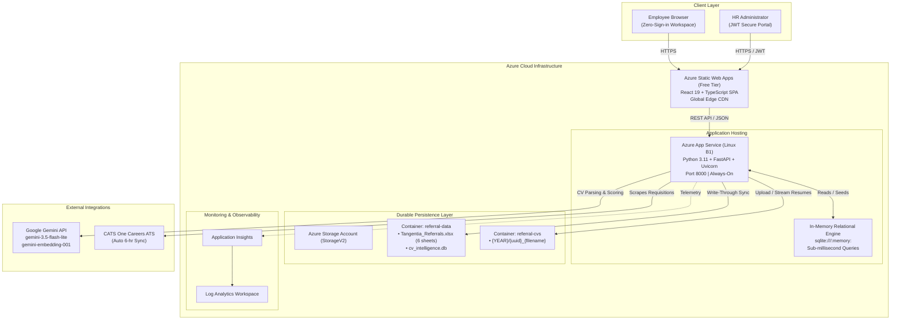

# Enterprise Azure Deployment & Operations Guide

**Project:** Tangentia Employee Referral Portal  
**Target Audience:** Enterprise Cloud Architects, DevOps Engineers, and System Administrators  
**Platform:** Microsoft Azure  
**Architecture Model:** Fast In-Memory Relational Engine (`sqlite:///:memory:`) + Azure Blob Storage Persistent Excel Audit Ledger  
**Version:** 2.1.0  
**Last Updated:** October 2026  

---

## 1. Executive Summary & Architecture Overview

The Tangentia Employee Referral Portal is engineered specifically for lean, enterprise-grade cloud operations. By consolidating data persistence into **Azure Blob Storage** (`referral-data` container holding `Tangentia_Referrals.xlsx`) and running high-speed relational queries in an **in-memory SQLite engine**, the architecture eliminates the operational complexity, provisioning overhead, and recurring monthly license costs of managed relational database servers.



---

## 2. Enterprise Cloud Resources Inventory

| Resource Type | Resource Name | Recommended SKU / Tier | Purpose in Solution |
|:---|:---|:---|:---|
| **Resource Group** | `tangentia-referral-portal` | Resource Group | Logical governance boundary for all portal components. |
| **App Service Plan** | `tangentia-backend-plan` | **Basic B1** (Linux) | Compute resource for the FastAPI backend (1 vCPU, 1.75 GB RAM, Always-On support). |
| **App Service (Web App)** | `tangentia-referral-api` | Python 3.11 | Hosts FastAPI REST API, AI intelligence background queue, and CATS ATS cron scheduler. |
| **Static Web Apps** | `tangentia-referral-portal` | **Free Tier** | Globally distributed edge hosting for the React 19 Single Page Application. |
| **Storage Account** | `tangentiareferralstor` | **StorageV2 (Standard_LRS)** | Durable storage for `referral-data` (audit ledger) and `referral-cvs` (resumes). |
| **Application Insights** | `tangentia-referral-insights` | Pay-as-you-go | Real-time performance monitoring, error tracking, and request diagnostics. |
| **Log Analytics Workspace** | `tangentia-log-workspace` | Pay-as-you-go | Centralized storage for system logs, HTTP metrics, and container diagnostics. |

---

## 3. Pre-Requisites for Deployment

Before deploying into an Azure tenant, ensure the following tooling and administrative permissions are configured:

1. **Azure CLI (`az`)**: Version 2.50.0 or higher.
   ```bash
   curl -sL https://aka.ms/InstallAzureCLIDeb | sudo bash
   az version
   ```
2. **Azure Account & Permissions**:
   - `Contributor` or `Owner` role on the target Azure Subscription or Resource Group.
3. **Build Tooling**:
   - Node.js 18+ & npm (`node -v`, `npm -v`)
   - Python 3.11+ (`python3 --version`)
   - `zip` utility (`sudo apt install zip`)
4. **Third-Party API Keys**:
   - Google Gemini API Key (`GEMINI_API_KEY`) for resume parsing and vector embeddings.

---

## 4. Step-by-Step Initial Deployment

The repository provides an automated zero-friction deployment script: [deploy-azure.sh](file:///home/vansh2004/Work/Tangentia-Referral-Portal/deploy-azure.sh).

### Step 4.1: Login and Set Subscription
```bash
az login
az account set --subscription "<YOUR_SUBSCRIPTION_ID_OR_NAME>"
```

### Step 4.2: Execute Deployment Script
```bash
chmod +x deploy-azure.sh
./deploy-azure.sh
```

### What the Automated Script Performs:
1. **Creates Resource Group & Storage Account**:
   - Provisions `tangentia-referral-portal` in the chosen Azure region.
   - Creates the Storage Account and ensures containers `referral-data` and `referral-cvs` are active.
   - Uploads the baseline 6-sheet Excel audit ledger template (`Tangentia_Referrals.xlsx`) to `referral-data`.
2. **Deploys App Service (Backend)**:
   - Configures App Service Plan (`B1`) with Python 3.11 runtime.
   - Sets environment variables: `DATABASE_URL="sqlite:///:memory:"`, `EXCEL_STORAGE_TYPE="blob"`, `STORAGE_TYPE="blob"`, `WEBSITES_PORT=8000`, `SCM_DO_BUILD_DURING_DEPLOYMENT="true"`.
   - Packages backend code (excluding `.venv`, caches, and sensitive files) into a deploy artifact and performs clean zip deployment.
3. **Deploys Static Web App (Frontend)**:
   - Generates production `.env.production` with live backend API URL.
   - Runs `npm ci` and `npm run build` (Vite production bundle).
   - Deploys static files to Azure Static Web Apps using `@azure/static-web-apps-cli`.
4. **Validates Health**:
   - Pings `https://<backend-url>/api/health` and verifies `HTTP 200 OK`.

---

## 5. Environment Variables & App Configuration

Below is the standard enterprise configuration reference applied to the Azure App Service:

| Variable Name | Production Value | Description |
|:---|:---|:---|
| `DATABASE_URL` | `sqlite:///:memory:` | In-memory relational engine for sub-millisecond query performance. |
| `EXCEL_STORAGE_TYPE` | `blob` | Directs the portal to synchronize state with Azure Blob Storage. |
| `STORAGE_TYPE` | `blob` | Sets candidate CV storage adapter to Azure Blob. |
| `AZURE_STORAGE_CONNECTION_STRING` | `DefaultEndpointsProtocol=https;AccountName=...` | Connection credentials for the portal storage account. |
| `BLOB_DATA_CONTAINER` | `referral-data` | Blob container storing `Tangentia_Referrals.xlsx` and `cv_intelligence.db`. |
| `BLOB_CV_CONTAINER` | `referral-cvs` | Blob container storing uploaded candidate resumes. |
| `SECRET_KEY` | `<64-char-random-hex>` | Cryptographic secret for signing HR Admin JWT tokens. |
| `ACCESS_TOKEN_EXPIRE_MINUTES`| `480` | JWT token lifetime (8 hours). |
| `GEMINI_API_KEY` | `<your-api-key>` | API key for Gemini models (`gemini-3.5-flash-lite`, `gemini-embedding-001`). |
| `CORS_ORIGINS` | `https://<your-static-web-app>.azurestaticapps.net` | Whitelisted frontend domains allowed to call the API. |
| `WEBSITES_PORT` | `8000` | Tells Azure Linux container router which port Uvicorn is listening on. |
| `SCM_DO_BUILD_DURING_DEPLOYMENT` | `true` | Instructs Azure Oryx builder to run `pip install` on deployment. |

---

## 6. Continuous Deployment & Re-Deployment Workflows

For routine day-to-day code updates, dedicated incremental re-deployment scripts are provided to eliminate full-stack rebuild times:

### 6.1 Backend-Only Updates
When modifying FastAPI routes, schemas, services, or models:
```bash
chmod +x redeploy-backend.sh
./redeploy-backend.sh
```
- **Execution Time:** ~2–3 minutes.
- **Process:** Packages Python code, uploads zip to App Service, triggers Oryx build, and restarts Uvicorn container without downtime to the frontend.

### 6.2 Frontend-Only Updates
When modifying React components, styling, or client-side logic:
```bash
chmod +x redeploy-frontend.sh
./redeploy-frontend.sh
```
- **Execution Time:** ~30–45 seconds.
- **Process:** Compiles TypeScript + Vite bundle, fetches Static Web App deployment token, and deploys directly to Azure Global CDN edge.

---

## 7. Data Backup, Retention & Disaster Recovery

### 7.1 Azure Blob Storage Durability
All application state resides in the Azure Storage Account under LRS (Locally Redundant Storage), replicated 3 times within the primary data center.

### 7.2 Manual Backup of Excel Audit Ledger
System administrators can pull the complete current database snapshot at any time:
```bash
az storage blob download \
  --account-name "tangentiareferralstor" \
  --container-name "referral-data" \
  --name "Tangentia_Referrals.xlsx" \
  --file "./backups/Tangentia_Referrals_$(date +%Y%m%d).xlsx" \
  --auth-mode key
```

### 7.3 Disaster Recovery / Cold Restart Procedure
If the App Service restarts or moves host nodes:
1. The FastAPI startup lifecycle runs [app/main.py](file:///home/vansh2004/Work/Tangentia-Referral-Portal/backend/app/main.py).
2. `BlobExcelService` pulls `Tangentia_Referrals.xlsx` from `referral-data`.
3. In-memory SQLite is fully populated with all historical referrals, job requisitions, user credentials, and status logs.
4. Normal operations resume within seconds without data loss.

---

## 8. Enterprise Security & Zero-Trust Governance

1. **Least-Privilege Network Access**:
   - Direct cloud blob URLs for resumes are never returned to frontend clients.
   - Candidate CVs are streamed exclusively via authenticated backend proxy endpoints (`/api/referrals/{id}/cv/download`) verifying user role authorization.
2. **Authentication Segmentation**:
   - **Employees**: Frictionless zero-login workspace with domain verification for submissions and status tracking.
   - **HR Administrators**: Strict JWT bearer token authentication (`/api/auth/login`) with PBKDF2-HMAC-SHA256 password hashing.
3. **Data Protection at Rest & In Transit**:
   - Enforced TLS 1.3 across App Service and Static Web Apps.
   - Azure Storage Service Encryption (SSE) automatically encrypts all blob files at rest with 256-bit AES.
4. **GDPR / DPDP Compliance**:
   - Built-in cascade purge endpoint (`DELETE /api/referrals/{id}`) purges the database entry, wipes the candidate row from Excel, and permanently deletes the resume blob from `referral-cvs`.

---

## 9. Monitoring, Diagnostics & Troubleshooting

### 9.1 Live Log Streaming
To inspect live backend traffic, CV parsing activity, and API errors:
```bash
az webapp log tail \
  --name "tangentia-referral-api" \
  --resource-group "tangentia-referral-portal"
```

### 9.2 Container Health & Startup Probes
To view the latest Docker container lifecycle and Oryx startup logs:
```bash
az webapp log startup show \
  --name "tangentia-referral-api" \
  --resource-group "tangentia-referral-portal"
```

### 9.3 Emergency App Service Restart
```bash
az webapp restart \
  --name "tangentia-referral-api" \
  --resource-group "tangentia-referral-portal"
```
