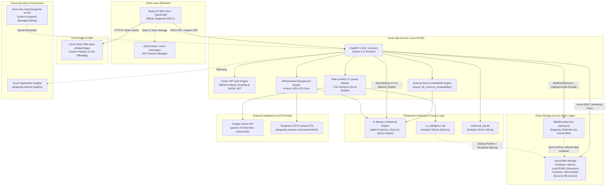
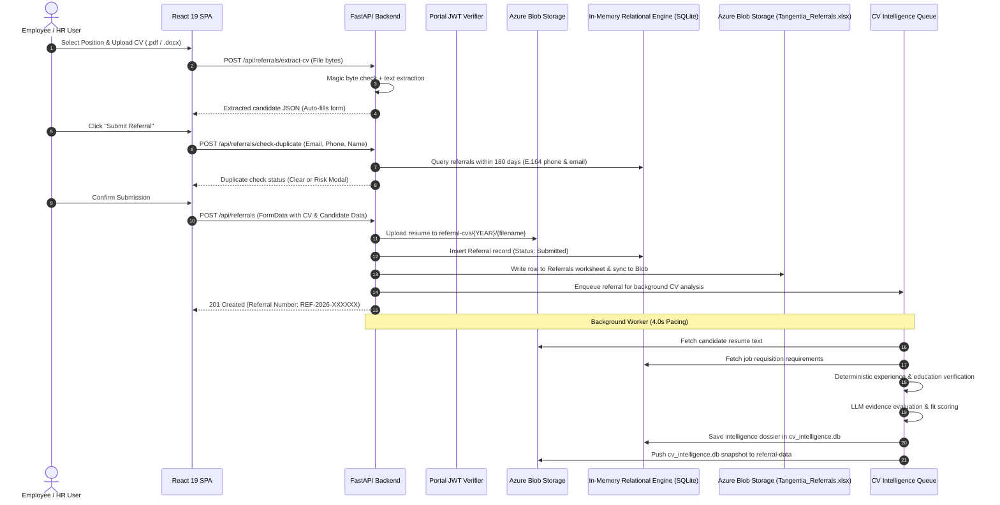
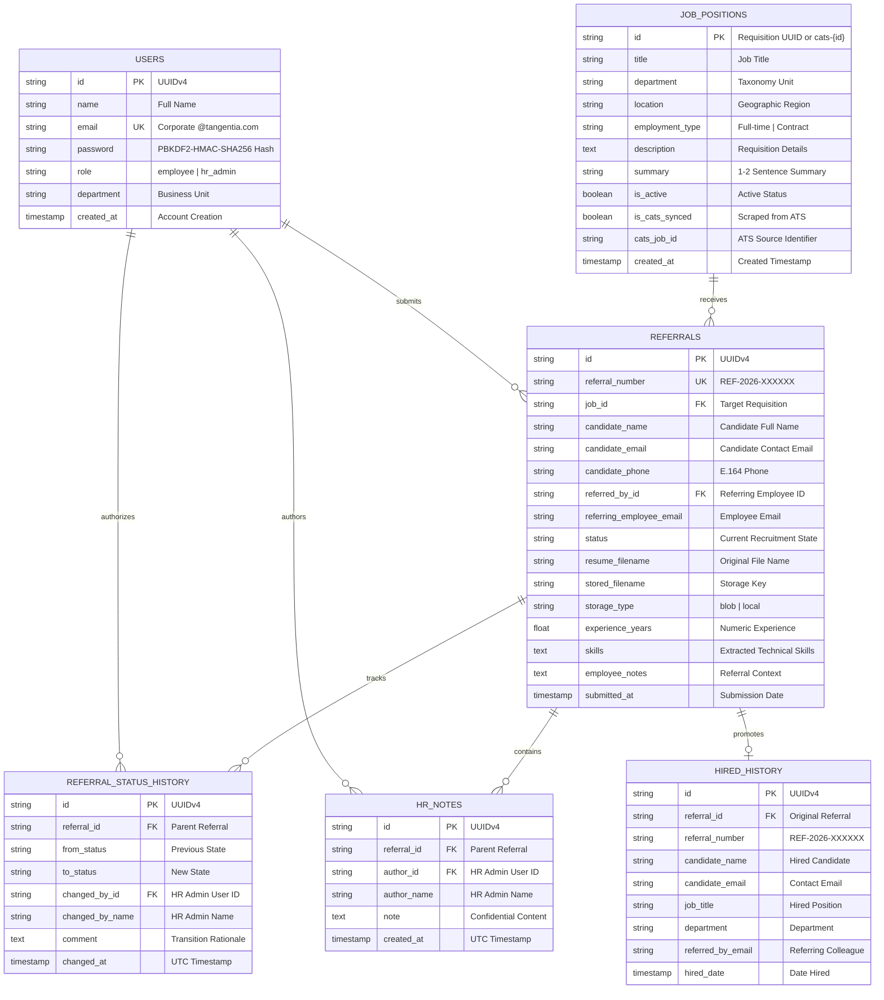
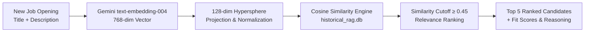
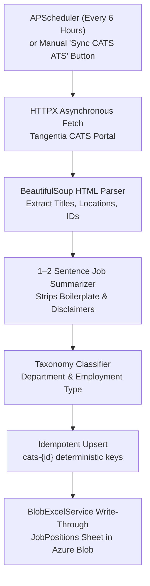

# Tangentia Employee Referral Portal — Technical Design & Architecture Documentation
**Version:** 2.1.0  
**Status:** Active Production Architecture  
**Author:** VickytheWicked  
**Last Updated:** October 2026  
**Target Platform:** Microsoft Azure (App Service, Static Web Apps, Blob Storage)

---

## 📌 Document Revision History

| Version | Release Date | Author | Summary of Changes |
|:---|:---|:---|:---|
| **1.0.0** | September 2026 | VickytheWicked | Initial architecture design covering portal JWT auth, legacy storage adapters, local mock Excel sync, basic CV intelligence pipeline, and CATS ATS scraping. |
| **2.0.0** | October 2026 | VickytheWicked | Major Architectural Overhaul: Complete eradication of legacy SharePoint traces; unified Azure Blob Storage document repository (`services/storage/`); high-speed in-memory relational engine (`sqlite:///:memory:`); dynamic database schema auto-compatibility engine (`ensure_db_schema_compatibility`); evidence-based requirement analyzer guaranteeing Total Experience (REQ #1) and Education (REQ #2) with anti-hallucination citations; pre-cached job requirements (`job_requirements_cache.json`); rate-limited async CV queue worker (4.0s inter-job delay, circuit breaker, backoff); historical candidate RAG engine (Gemini `text-embedding-004` + 128-dim hypersphere projection); streamlined submission form; frontend 4s watchdog and 25s network timeout resilience; official Tangentia 2026 branding; and verified 37-endpoint REST API reference. |
| **2.1.0** | October 2026 | VickytheWicked | **Architecture Specificity Refinement**: Formalized removal of Microsoft Entra ID SSO in favor of dedicated Corporate HR JWT Authentication (`/api/auth/login`) with PBKDF2-HMAC-SHA256 password security and frictionless zero-sign-in Employee Workspace. Formalized complete removal of Microsoft Excel Online (Graph API) and external PostgreSQL in favor of an in-memory SQLite query engine backed persistently by the Azure Blob Storage Excel Ledger (`BlobExcelService`), syncing `Tangentia_Referrals.xlsx` write-through directly to the `referral-data` blob container. Automated Azure storage provisioning in deployment scripts. |

---

## 📑 Table of Contents

1. [System & Executive Overview](#1-system--executive-overview)
2. [End-to-End Enterprise Architecture](#2-end-to-end-enterprise-architecture)
3. [Technology Stack & Core Dependencies](#3-technology-stack--core-dependencies)
4. [Repository & Directory Structure](#4-repository--directory-structure)
5. [Backend Architecture (FastAPI + Python 3.11+)](#5-backend-architecture-fastapi--python-311)
6. [Data Models, Database Schema & Auto-Compatibility](#6-data-models-database-schema--auto-compatibility)
7. [Cloud Document Storage & Azure Blob Storage Excel Ledger](#7-cloud-document-storage--azure-blob-storage-excel-ledger)
8. [AI-Powered CV Intelligence & Evidence-Based Requirement Engine](#8-ai-powered-cv-intelligence--evidence-based-requirement-engine)
9. [Historical Candidate RAG Recommendations Engine](#9-historical-candidate-rag-recommendations-engine)
10. [CATS Careers ATS Web Scraper & Background Cron Scheduler](#10-cats-careers-ats-web-scraper--background-cron-scheduler)
11. [Frontend Architecture & Single-Page Application (React 19)](#11-frontend-architecture--single-page-application-react-19)
12. [Complete REST API Reference (37 Verified Endpoints)](#12-complete-rest-api-reference-37-verified-endpoints)
13. [Configuration Reference & Environment Matrix](#13-configuration-reference--environment-matrix)
14. [Infrastructure, Deployment & DevOps Automation](#14-infrastructure-deployment--devops-automation)
15. [Quality Assurance, Test Coverage & Verification Matrix](#15-quality-assurance-test-coverage--verification-matrix)
16. [Security, Zero-Trust Controls & Observability](#16-security-zero-trust-controls--observability)

---

## 1. System & Executive Overview

The **Tangentia Employee Referral Portal** is an enterprise-grade talent acquisition and referral platform engineered for Tangentia's global operations across India, the United States, and Canada. The platform bridges the gap between active employee networks and corporate recruitment teams by automating the end-to-end candidate referral lifecycle.

```
┌────────────────────────────────────────────────────────────────────────┐
│               Tangentia Employee Referral Portal Ecosystem             │
├────────────────┬───────────────────────────────┬───────────────────────┤
│    Employee    │     AI Intelligence Engine    │    HR Recruitment     │
│   Workspace    │     (Evidence & Relevance)    │    Management Hub     │
└───────┬────────┴───────────────┬───────────────┴───────────┬───────────┘
        ▼                        ▼                           ▼
┌──────────────┐         ┌──────────────┐            ┌──────────────┐
│ Frictionless │         │ Multi-Stage  │            │ Pipeline     │
│ Submissions  │         │ CV Parsing   │            │ Management   │
├──────────────┤         ├──────────────┤            ├──────────────┤
│• Zero login  │         │• Deterministic│           │• Full status │
│  barrier     │         │  REQ #1 Exp  │            │  progression │
│• AI CV Auto- │         │• REQ #2 Edu  │            │• Audit trail │
│  fill form   │         │• Factual     │            │• Private HR  │
│• 180-Day Dup │         │  citations   │            │  notes thread│
│  Prevention  │         │• 4s Rate-    │            │• Historical  │
│• Status radar│         │  limited     │            │  RAG search  │
│  & portfolio │         │  queue       │            │• Excel export│
└──────────────┘         └──────────────┘            └──────────────┘
        │                        │                           │
        └────────────────────────┼───────────────────────────┘
                                 ▼
         ┌───────────────────────────────────────────────┐
         │          Unified Azure Cloud Storage          │
         ├───────────────────────┬───────────────────────┤
         │  referral-cvs/{YEAR}/ │     referral-data/    │
         │  (Candidate Resumes)  │ (Tangentia_Referrals) │
         └───────────────────────┴───────────────────────┘
```

### Core Architectural Highlights

| Functional Domain | Architectural Implementation | Key Modules / Services |
|:---|:---|:---|
| **Employee Referral Experience** | Zero-friction submission without login barriers. Auto-populates candidate details via instant CV parsing, prevents duplicates within a 180-day window, and provides a personal tracking dashboard. | `SubmitReferralPage.tsx`, `CVExtractor.tsx`, `referral_service.py` |
| **HR Administration & RBAC** | Dedicated corporate authentication using `@tangentia.com` email and PBKDF2-HMAC-SHA256 salted password hashing, issuing 7-day signed JWT tokens. Enforces granular role-based access control. | `auth_service.py`, `AuthContext.tsx`, `deps.py` |
| **Azure Blob Storage Excel Ledger** | Complete persistent audit ledger in `referral-data/Tangentia_Referrals.xlsx`. Every referral submission, status transition, HR note, and job posting writes through via `openpyxl` and syncs immediately to Azure Blob Storage. | `blob_excel_service.py`, `local_excel_service.py`, `sync.py` |
| **Document Archival & Proxy Streaming** | Candidate CVs (.pdf, .docx) are stored in `referral-cvs/{YEAR}/` with yearly partitioning. Cloud storage URLs are never exposed to clients; downloads stream through authenticated FastAPI endpoints. | `blob_service.py`, `referrals.py` |
| **AI Evidence-Based Requirement Engine** | Evaluates candidate CVs against requisition requirements with mathematical experience verification (REQ #1), degree matching (REQ #2), and factual quotations. Sequential 4.0s queue pacing prevents LLM rate-limit throttling. | `requirement_analyzer.py`, `queue.py`, `gemini-3.5-flash-lite` |
| **Historical Candidate RAG Search** | Recovers passive talent from past applications for newly published positions using vector similarity (Gemini `text-embedding-004` + 128-dimensional unit hypersphere projection). | `historical_suggestions/`, `rag_service.py` |
| **Automated CATS ATS Synchronization** | Automated 6-hour cron worker scrapes active job openings from Tangentia's CATS Careers ATS, synthesizes 1–2 sentence job summaries, maps corporate taxonomy, and updates databases idempotently. | `cats_scraper.py`, `cats_scheduler.py` |

---

## 2. End-to-End Enterprise Architecture

### 2.1 Component Interaction Diagram



### 2.2 Complete Request Lifecycle



---

## 3. Technology Stack & Core Dependencies

| Layer | Component | Version | Architectural Responsibility |
|:---|:---|:---|:---|
| **Runtime Environment** | [Python](https://www.python.org/) | `3.11.x` | Base backend execution environment optimized for Azure Linux App Service. |
| **Web Framework** | [FastAPI](https://fastapi.tiangolo.com/) | `0.115.0+` | High-performance asynchronous API engine with Pydantic v2 validation. |
| **ASGI Server** | [Uvicorn](https://www.uvicorn.org/) | `0.30.0+` | Production ASGI server managing asynchronous HTTP request workers. |
| **Relational Query Engine** | SQLite (In-Memory) + [SQLAlchemy](https://www.sqlalchemy.org/) | `2.0.35+` | High-speed relational engine executing sub-millisecond queries, seeded and synchronized with Azure Blob Storage. |
| **Database Migrations** | [Alembic](https://alembic.sqlalchemy.org/) | `1.13.0+` | Schema version control and automated migration execution at server startup. |
| **Data Validation** | [Pydantic](https://docs.pydantic.dev/) | `2.9.0+` | Strict request parsing, environment variable loading via `pydantic-settings`. |
| **Cloud Storage** | [Azure Storage Blob SDK](https://pypi.org/project/azure-storage-blob/) | `12.23.0+` | Candidate CV archival (`referral-cvs`) and persistent Excel ledger sync (`referral-data`). |
| **AI LLM Engine** | [Google GenAI SDK](https://ai.google.dev/) | `0.1.1+` | Gemini API (`gemini-3.5-flash-lite`, `text-embedding-004`) for parsing and RAG embeddings. |
| **Document Parsers** | `pdfplumber`, `PyMuPDF (fitz)`, `python-docx` | Latest | Multi-stage fault-tolerant text and table extraction from candidate resumes. |
| **Spreadsheet Engine** | [openpyxl](https://openpyxl.readthedocs.io/) | `3.1.5+` | Multi-sheet Excel engine supporting 6-worksheet audit ledger formatting and styles. |
| **Excel Blob Ledger** | `BlobExcelService` | Internal | Write-through synchronization to `Tangentia_Referrals.xlsx` in Azure Blob Storage. |
| **Background Scheduler**| [APScheduler](https://apscheduler.readthedocs.io/) | `3.10.4+` | In-process scheduler driving the 6-hour automated CATS ATS synchronization. |
| **HTTP Client** | [HTTPX](https://www.python-httpx.org/) | `0.27.0+` | Asynchronous HTTP client for external ATS web scraping and health monitoring. |
| **Frontend Framework** | [React](https://react.dev/) | `19.0.0` | Component hierarchy with state hooks and zero-latency rendering. |
| **Language** | [TypeScript](https://www.typescriptlang.org/) | `5.5.0+` | End-to-end type safety shared across models, API contracts, and form inputs. |
| **Build & Bundler** | [Vite](https://vitejs.dev/) | `8.2.2+` | Modern build engine compiling production client assets in under 300ms. |
| **Icons & Design** | [Lucide React](https://lucide.dev/) | `0.450.0+` | Unified icon library supporting the Tangentia 2026 enterprise dark theme. |
| **Authentication Engine**| `python-jose`, `passlib` | `3.3.0+` | Corporate HR JWT authentication and PBKDF2 password security. |

---

## 4. Repository & Directory Structure

```text
Tangentia-Referral-Portal/
├── backend/
│   ├── alembic.ini                              # Database migration configuration
│   ├── alembic_migrations/                      # Alembic revision scripts
│   ├── app/
│   │   ├── api/                                 # REST API route controllers
│   │   │   ├── auth.py                          # HR corporate login & session profile
│   │   │   ├── deps.py                          # JWT auth & RBAC route dependencies
│   │   │   ├── hr.py                            # Recruiter hub, status updates, notes
│   │   │   ├── jobs.py                          # Job openings & CATS sync endpoints
│   │   │   ├── referrals.py                     # Candidate submission & duplicate check
│   │   │   ├── cv_intelligence.py               # AI evaluation dossiers & queue status
│   │   │   └── historical_suggestions.py        # Passive candidate RAG recommendations
│   │   ├── cv_intelligence/                     # Resume Intelligence Engine
│   │   │   ├── blob_sync.py                     # Azure Blob backup/restore for SQLite
│   │   │   ├── candidate_evaluator.py           # JEV relevance scoring & questions
│   │   │   ├── cv_service.py                    # Orchestration layer for AI pipelines
│   │   │   ├── database.py                      # Isolated SQLite schema for CV metadata
│   │   │   ├── extractor.py                     # Multi-engine PDF/DOCX text parser
│   │   │   ├── llm_client.py                    # Gemini & Azure OpenAI client wrapper
│   │   │   ├── queue.py                         # 4.0s rate-limited background worker
│   │   │   └── requirement_analyzer.py          # Evidence-based requirement analyzer
│   │   ├── historical_suggestions/              # Historical Talent RAG Engine
│   │   │   ├── database.py                      # Vector SQLite storage for candidate embeddings
│   │   │   └── rag_service.py                   # Hypersphere projection & cosine similarity
│   │   ├── models/                              # SQLAlchemy ORM database models
│   │   ├── schemas/                             # Pydantic request & response schemas
│   │   ├── services/                            # Business logic & external adapters
│   │   │   ├── auth_service.py                  # PBKDF2 password hashing & JWT tokens
│   │   │   ├── cats_scheduler.py                # 6-Hour APScheduler cron job manager
│   │   │   ├── cats_scraper.py                  # BeautifulSoup scraper for live CATS Careers
│   │   │   ├── referral_service.py              # Referral CRUD, duplicate check, atomic upload
│   │   │   ├── excel/                           # Excel Ledger Integration
│   │   │   │   ├── base.py                      # ExcelServiceInterface abstract definition
│   │   │   │   ├── blob_excel_service.py        # Azure Blob Storage Excel ledger service
│   │   │   │   ├── local_excel_service.py       # openpyxl local file mock service
│   │   │   │   └── sync.py                      # Ledger initialization & write-through sync
│   │   │   └── storage/                         # Document & CV Cloud Storage Subsystem
│   │   │       ├── base.py                      # StorageServiceInterface & StorageUploadResult
│   │   │       ├── blob_service.py              # Production Azure Blob Storage service
│   │   │       └── local_service.py             # Local filesystem mock storage adapter
│   │   ├── utils/                               # Security sanitization & file validation
│   │   ├── config.py                            # Centralized Pydantic application settings
│   │   ├── database.py                          # SQLAlchemy engine & session factory
│   │   └── main.py                              # FastAPI application factory & lifespan
│   ├── data/
│   │   ├── Tangentia_Referrals.xlsx             # Baseline seed Excel workbook (6 sheets)
│   │   └── job_requirements_cache.json         # Pre-cached structured requirements
│   ├── tests/                                   # Pytest automated test suite (125 tests)
│   ├── Dockerfile                               # Production backend container definition
│   └── requirements.txt                         # Pinned Python package dependencies
├── frontend/
│   ├── src/
│   │   ├── assets/                              # Static visual brand assets
│   │   ├── auth/                                # Portal JWT Authentication Context
│   │   │   └── AuthContext.tsx                  # React AuthContext with 4s safety watchdog
│   │   ├── components/                          # Reusable UI Component Library
│   │   │   ├── common/                          # Status badges, modals, search bars
│   │   │   ├── employee/                        # Employee submission components
│   │   │   ├── hr/                              # Recruiter drawer, notes, audit timeline
│   │   │   └── layout/                          # Navigation header, sidebar, footer
│   │   ├── pages/                               # Route View Components
│   │   │   ├── employee/                        # Employee portal pages
│   │   │   └── hr/                              # HR recruiter dashboard & candidate database
│   │   ├── services/                            # Axios API client & token interceptors
│   │   ├── types/                               # TypeScript domain model definitions
│   │   ├── App.tsx                              # Application routing & role gating
│   │   └── index.css                            # Tangentia 2026 enterprise design tokens
│   ├── index.html                               # HTML5 entry template
│   ├── package.json                             # Frontend dependencies & scripts
│   └── vite.config.ts                           # Vite build configuration
├── deploy-azure.sh                              # Automated Azure cloud deployment script
└── README.md                                    # Project documentation & onboarding
```

---

## 5. Backend Architecture (FastAPI + Python 3.11+)

The backend architecture is structured around modular FastAPI routers, dependency-injected services, and an in-process background worker framework.

### 5.1 Application Lifespan & Startup Sequence

Upon application startup (`app/main.py`), the portal executes the following bootstrap sequence:

```
[Start Uvicorn] 
       │
       ▼
1. Database Connectivity Check ──────────► Verifies connection to PostgreSQL / SQLite
       │
       ▼
2. Schema Auto-Compatibility ────────────► ensure_db_schema_compatibility() inspects tables
       │                                   and injects missing columns dynamically
       ▼
3. Blob Storage Containers ──────────────► Ensures 'referral-cvs' and 'referral-data' exist
       │
       ▼
4. Excel Ledger Hydration ───────────────► BlobExcelService downloads Tangentia_Referrals.xlsx
       │                                   from blob container into local memory cache
       ▼
5. Background Worker Launch ─────────────► Starts 4.0s CV processing queue worker
       │
       ▼
6. ATS Scheduler Initialization ─────────► Registers 6-hour CATS ATS synchronization cron
```

### 5.2 Dynamic Schema Auto-Compatibility Engine

To eliminate runtime deployment failures caused by schema discrepancies across environments, the portal includes an automated compatibility engine (`ensure_db_schema_compatibility`):

```python
def ensure_db_schema_compatibility(engine):
    """
    Inspects live database schema at boot and dynamically provisions missing columns.
    Ensures safe, non-destructive schema evolution without breaking existing tables.
    """
    inspector = inspect(engine)
    with engine.begin() as conn:
        # Verify and add candidate referral tracking columns
        columns = {col['name'] for col in inspector.get_columns('referrals')}
        if 'storage_type' not in columns:
            conn.execute(text("ALTER TABLE referrals ADD COLUMN storage_type VARCHAR(50) DEFAULT 'blob'"))
        if 'stored_filename' not in columns:
            conn.execute(text("ALTER TABLE referrals ADD COLUMN stored_filename VARCHAR(255)"))
```

---

## 6. Data Models, Database Schema & Auto-Compatibility

### 6.1 Entity-Relationship Diagram



---

## 7. Cloud Document Storage & Azure Blob Storage Excel Ledger

### 7.1 Unified Storage Architecture (`services/storage/`)

Candidate resume storage is abstracted behind the `StorageServiceInterface` protocol:

```python
class StorageServiceInterface(ABC):
    @abstractmethod
    async def upload_cv(self, file_bytes: bytes, filename: str, referral_number: str) -> StorageUploadResult: ...
    @abstractmethod
    async def download_cv(self, drive_id=None, item_id=None, referral_number=None, stored_filename=None, ...) -> Tuple[bytes, str, str]: ...
    @abstractmethod
    async def delete_cv(self, drive_id=None, item_id=None) -> bool: ...
```

#### Production Azure Blob Storage (`BlobStorageService`)
- **Container Strategy:** Resumes are archived in `referral-cvs` with yearly hierarchical folder partitioning: `referral-cvs/{YEAR}/{stored_filename}`.
- **Content Types:** Content-Type headers are explicitly set (`application/pdf` or `application/vnd.openxmlformats-officedocument.wordprocessingml.document`).
- **Atomic Rollback:** If a database commit fails during referral creation, `delete_cv` is invoked immediately in the exception handler to ensure **zero orphaned files** in cloud storage.
- **Zero-Trust Proxied Streaming:** Raw blob URLs and Azure Storage Account connection strings are **never exposed** to client browsers. Resumes are streamed securely through `/api/referrals/{id}/cv` using FastAPI `StreamingResponse`.

### 7.2 Azure Blob Storage Excel Audit Ledger (`BlobExcelService`)

The portal writes every referral submission, status transition, confidential HR note, and job posting directly to an Excel workbook stored in Azure Blob Storage (`referral-data/Tangentia_Referrals.xlsx`), providing corporate auditability without database vendor lock-in.

```
┌────────────────────────────────────────────────────────────────────────┐
│               Azure Blob Storage Excel Ledger Workbook                 │
│               (referral-data/Tangentia_Referrals.xlsx)                 │
├──────────────┬──────────────┬──────────────┬──────────────┬────────────┤
│  Referrals   │ JobPositions │StatusHistory │   HRNotes    │   Users    │
│ (Candidates) │ (Openings)   │ (Audit Trail)│(Private Eval)│(Accounts)  │
└──────────────┴──────────────┴──────────────┴──────────────┴────────────┘
```

#### 6 Dedicated Worksheets
1. **`Referrals`**: Candidate personal information, submission timestamp, contact details, years of experience, status, and storage item pointers.
2. **`JobPositions`**: Requisition titles, departments, locations, employment types, and active statuses.
3. **`StatusHistory`**: Chronological status changes, timestamp, author, and review comments.
4. **`HRNotes`**: Confidential recruiter evaluations and compensation notes.
5. **`Users`**: Internal system user records, password hashes, and security roles.
6. **`HiredHistory`**: Permanent historical ledger of all successfully hired candidates.

#### Persistence Cycle
- On startup, `BlobExcelService` initializes by downloading `Tangentia_Referrals.xlsx` from the `referral-data` container into local cache.
- Read and write mutations are executed through `openpyxl` with thread-safe operations.
- On each mutation (`append_referral`, `update_referral_status`, `append_hr_note`, `save_job_position`), the updated `.xlsx` binary is immediately uploaded back to Azure Blob Storage, guaranteeing durability across container recycles.

---

## 8. AI-Powered CV Intelligence & Evidence-Based Requirement Engine

### 8.1 Prioritized Requirement Analysis Pipeline

The analyzer decomposes job descriptions into discrete, verifiable requirement specifications and evaluates candidate resumes against them using strict prioritization rules:

```
┌────────────────────────────────────────────────────────────────┐
│             Strict Requirement Priority Ordering               │
├────────────────────────────────────────────────────────────────┤
│ REQ #1: Total Professional Experience (Numeric Years)          │
│         - Evaluated deterministically from CV work chronology  │
├────────────────────────────────────────────────────────────────┤
│ REQ #2: Education & Academic Qualifications                    │
│         - Evaluated for degrees, certifications & disciplines  │
├────────────────────────────────────────────────────────────────┤
│ REQ #3: Core Role & Domain Alignment                           │
│         - Evaluated for industry, vertical & function match    │
├────────────────────────────────────────────────────────────────┤
│ REQ #4+: Technical Skills, Frameworks & Tooling                │
│         - Evaluated for hands-on technical proficiency         │
└────────────────────────────────────────────────────────────────┘
```

### 8.2 Pure-Python Deterministic Mathematical Verification

To prevent LLM mathematical hallucinations (e.g. claiming a candidate with 3 years experience meets an 8-year requirement), the requirement engine pre-computes numeric timeline facts using pure Python before invoking the LLM:

```python
# Pure-Python deterministic verification injected into prompt
facts = {
    "cv_calculated_experience_years": 4.5,
    "req_minimum_experience_years": 7.0,
    "meets_minimum_experience": False,
    "experience_gap_years": -2.5
}
```

The LLM is strictly constrained: if `meets_minimum_experience` is False, REQ #1 **must** be graded as `NOT_MET` or `PARTIALLY_MET`. It is mathematically impossible for the system to award full credit for insufficient experience.

### 8.3 Rate-Limited Queue Worker (4.0s Pacing)

To guarantee 100% compliance with Google Gemini API rate limits (e.g. 15 requests/minute on standard tiers), the background evaluation queue enforces a sequential 4.0-second delay between processed CVs:

```python
async def _process_queue_loop(self):
    while self._running:
        job = await self._queue.get()
        try:
            await self._evaluate_candidate(job)
        finally:
            self._queue.task_done()
            # Enforce 4.0s delay to respect LLM rate limits
            await asyncio.sleep(4.0)
```

The worker features an automatic circuit breaker: if 3 consecutive API failures occur, it triggers an exponential backoff cooling period (30s, 60s, 120s) before resuming.

---

## 9. Historical Candidate RAG Recommendations Engine

When recruiters open a new job requisition, the Historical RAG Engine automatically surfaces relevant candidates who were referred for previous positions:



- **Dual-Embedding Architecture**: Combines semantic embeddings (`text-embedding-004`) with a deterministic 128-dimensional hypersphere projection of extracted technical n-grams.
- **Threshold Cutoff**: Only candidates achieving a cosine similarity $\ge 0.45$ are surfaced.
- **Direct Re-engagement**: Recruiters can review the candidate's original evaluation dossier and directly re-assign them to the active requisition with one click.

---

## 10. CATS Careers ATS Web Scraper & Background Cron Scheduler

The portal maintains bidirectional alignment with Tangentia's production careers portal (`tangentia.catsone.com/careers/9463-General`):



- **Deterministic Keys**: Positions are assigned deterministic identifiers (`cats-{id}`) preventing duplicates.
- **ATS Badge & Deep Link**: Synced positions carry a distinct `CATS ATS` visual badge on the job board and an **"Open in CATSOne"** deep-link button opening the live requisition directly in the recruiter's browser.

---

## 11. Frontend Architecture & Single-Page Application (React 19)

### 11.1 Component Hierarchy & Route Layout

```
App.tsx
├── AuthProvider (AuthContext.tsx)
│   ├── Navigation Header (Navbar.tsx)
│   │   ├── Brand Logo (Tangentia 2026)
│   │   ├── Navigation Links (Openings, My Referrals, Hired History)
│   │   └── HR Portal Login / User Profile Pill
│   └── Main Content Area (React Router v6)
│       ├── Public / Employee Routes
│       │   ├── JobOpeningsPage.tsx
│       │   ├── SubmitReferralPage.tsx (CVExtractor, DuplicateModal)
│       │   ├── MyReferralsPage.tsx (WithdrawModal)
│       │   └── HiredHistoryPage.tsx (Excel Export)
│       └── Protected HR Routes (RequireHRAdmin Guard)
│           ├── HRDashboardPage.tsx (Funnel, Metrics, Leaderboard)
│           ├── AllReferralsPage.tsx (Candidate Table, Filters, Export)
│           ├── CandidateDossierModal.tsx (AI Requirement Matching)
│           ├── AnalyticsPage.tsx (Departmental Stats & Conversion)
│           └── RequisitionManagerPage.tsx (Job CRUD, CATS Sync)
```

### 11.2 Frontend Resilience & Timeouts

- **4-Second Auth Watchdog (`AuthContext.tsx`):** If token verification or network response stalls, an automatic 4-second timeout releases the loading barrier to prevent indefinite UI hangs.
- **25-Second API Timeout (`api.ts`):** Central Axios REST client enforces a 25-second network request timeout with automatic abort signal handling.

---

## 12. Complete REST API Reference (37 Verified Endpoints)

### 12.1 Authentication & Profile (`/api/auth`)
| Method | Endpoint | Access Role | Description |
|:---|:---|:---|:---|
| `GET` | `/api/auth/config` | Public | Returns authentication domain configuration and dev-mode status. |
| `POST` | `/api/auth/login` | Public | Authenticates HR recruiter using corporate credentials and returns JWT bearer token. |
| `GET` | `/api/auth/me` | Authenticated | Returns current authenticated user profile, roles, and assigned permissions. |

### 12.2 Health & Diagnostics (`/api`)
| Method | Endpoint | Access Role | Description |
|:---|:---|:---|:---|
| `GET` | `/api/health` | Public | Returns system health status, active environment, storage mode, and service name. |

### 12.3 Job Positions & Requisitions (`/api/jobs`)
| Method | Endpoint | Access Role | Description |
|:---|:---|:---|:---|
| `GET` | `/api/jobs` | Public | Lists all active job requisitions (with department, location, and type filters). |
| `POST` | `/api/jobs` | HR Admin | Manually creates a new job position requisition. |
| `GET` | `/api/jobs/{job_id}` | Public | Retrieves detailed description and metadata for a specific job position. |
| `PUT` | `/api/jobs/{job_id}` | HR Admin | Updates requisition details, requirements, or active status. |
| `POST` | `/api/jobs/sync-cats` | HR Admin | Triggers an immediate manual scraping synchronization with Tangentia CATS ATS. |
| `GET` | `/api/jobs/sync-cats/preview` | HR Admin | Fetches real-time preview of active job listings currently published on CATS ATS. |
| `GET` | `/api/jobs/sync-cats/status` | HR Admin | Returns timestamp and metrics of the last CATS ATS synchronization run. |

### 12.4 Referral Submissions & Management (`/api/referrals`)
| Method | Endpoint | Access Role | Description |
|:---|:---|:---|:---|
| `POST` | `/api/referrals/check-duplicate` | Public | Evaluates candidate email, phone, and target role against 180-day duplicate window. |
| `POST` | `/api/referrals/extract-cv` | Public | Instant resume text extraction returning candidate details for form auto-fill. |
| `POST` | `/api/referrals` | Public / Employee | Submits a new candidate referral with resume file upload to cloud storage. |
| `GET` | `/api/referrals` | Employee / HR | Retrieves list of referrals submitted by the employee (or filterable by email). |
| `GET` | `/api/referrals/{referral_id}` | Referrer / HR | Retrieves detailed referral information, status history, and candidate profile. |
| `GET` | `/api/referrals/{referral_id}/cv` | Referrer / HR | Authenticated proxy download streaming the original CV document from cloud storage. |
| `GET` | `/api/referrals/{referral_id}/status-history`| Referrer / HR | Retrieves the chronological status transition audit log for the referral. |
| `PUT` | `/api/referrals/{referral_id}/withdraw` | Referrer | Allows referring employee to withdraw their submitted referral with optional note. |
| `GET` | `/api/referrals/hired-history` | Employee / HR | Lists all candidate referrals that successfully achieved `Hired` status. |
| `GET` | `/api/referrals/hired-history/excel-export` | Employee / HR | Generates and downloads styled Microsoft Excel spreadsheet of hired candidates. |

### 12.5 HR Administration & Pipeline (`/api/hr`)
| Method | Endpoint | Access Role | Description |
|:---|:---|:---|:---|
| `GET` | `/api/hr/referrals` | HR Admin | Returns comprehensive candidate database with multi-dimensional filtering. |
| `PUT` | `/api/hr/referrals/{referral_id}/status` | HR Admin | Transitions candidate recruitment status and appends audit trail entry. |
| `DELETE` | `/api/hr/referrals/{referral_id}` | HR Admin | Permanently purges candidate referral, CV, notes, and AI intelligence records. |
| `PUT` | `/api/hr/referrals/{referral_id}/archive` | HR Admin | Archives referral record for historical talent retrieval. |
| `GET` | `/api/hr/referrals/{referral_id}/notes` | HR Admin | Retrieves private recruiter notes thread for the referral. |
| `POST` | `/api/hr/referrals/{referral_id}/notes` | HR Admin | Adds a confidential recruiter evaluation or compensation note. |
| `GET` | `/api/hr/referrals/excel-export` | HR Admin | Downloads the full 6-sheet audit ledger Excel workbook directly from storage. |
| `GET` | `/api/hr/analytics` | HR Admin | Returns pipeline funnel conversion rates, departmental stats, and referrer rankings. |

### 12.6 CV Intelligence & Evidence Engine (`/api/cv-intelligence`)
| Method | Endpoint | Access Role | Description |
|:---|:---|:---|:---|
| `GET` | `/api/cv-intelligence/status` | HR Admin | Returns AI engine health, model configuration, and queue worker backlog status. |
| `GET` | `/api/cv-intelligence/suggestions` | HR Admin | Returns AI candidate rankings and match scores grouped across all job openings. |
| `GET` | `/api/cv-intelligence/candidates/{referral_id}` | HR Admin | Returns deep candidate intelligence dossier with evidence-grounded requirements. |
| `POST` | `/api/cv-intelligence/process/{referral_id}` | HR Admin | Manually triggers immediate re-extraction and re-scoring of a candidate CV. |
| `POST` | `/api/cv-intelligence/process-opening/{position_id}` | HR Admin | Evaluates all submitted candidates against a specific job opening. |
| `POST` | `/api/cv-intelligence/openings/{position_id}/process-requirements` | HR Admin | Triggers LLM requirement extraction and caching for a specific job requisition. |
| `GET` | `/api/cv-intelligence/openings/{position_id}/requirements` | HR Admin | Retrieves cached structured requirement specifications for a job position. |

### 12.7 Historical Candidate RAG Search (`/api/historical-suggestions`)
| Method | Endpoint | Access Role | Description |
|:---|:---|:---|:---|
| `GET` | `/api/historical-suggestions/status` | HR Admin | Returns status of the Historical RAG embedding index and vector database. |
| `GET` | `/api/historical-suggestions/positions/{position_id}` | HR Admin | Retrieves ranked passive candidate recommendations matching requisition requirements. |

---

## 13. Configuration Reference & Environment Matrix

| Environment Variable | Production Default | Description & Operational Notes |
|:---|:---|:---|
| `PROJECT_NAME` | `Tangentia Employee Referral Portal` | Application brand title. |
| `ENVIRONMENT` | `production` | Set to `production` or `development`. |
| `DEBUG` | `False` | Disables debug logs and development exceptions in production. |
| `DEV_MODE` | `False` | Disables mock authentication and requires valid production tokens. |
| `DATABASE_URL` | `postgresql+psycopg2://...` | Connection string for Azure Database for PostgreSQL Flexible Server. |
| `STORAGE_TYPE` | `blob` | `blob` (Azure Blob Storage) or `mock` (local filesystem disk). |
| `EXCEL_STORAGE_TYPE` | `blob` | `blob` for Azure Blob Storage Excel ledger (`referral-data`); `mock` for local Openpyxl. |
| `AZURE_STORAGE_CONNECTION_STRING`| Key Vault Secret | Storage account connection string for CV resumes and Excel ledger. |
| `BLOB_CV_CONTAINER` | `referral-cvs` | Container name for candidate resume uploads. |
| `BLOB_DATA_CONTAINER` | `referral-data` | Container name for `Tangentia_Referrals.xlsx` and SQLite database snapshots. |
| `BLOB_CV_INTELLIGENCE_NAME` | `cv_intelligence.db` | Blob object key for persisting the AI intelligence SQLite database. |
| `JWT_SECRET_KEY` | Key Vault Secret | 256-bit cryptographically secure key for signing backend JWT tokens. |
| `CV_INTELLIGENCE_ENABLED`| `True` | Activates AI resume parsing and requirement matching pipeline. |
| `CV_LLM_PROVIDER` | `gemini` | LLM provider: `gemini` (Google AI Studio) or `azure_openai`. |
| `CV_LLM_MODEL` | `gemini-3.5-flash-lite` | Primary LLM model identifier. |
| `GEMINI_API_KEY` | Key Vault Secret | Google Gemini API key. |
| `CV_STORAGE_TYPE` | `azure` | `azure` to back up `cv_intelligence.db` to Azure Blob Storage on shutdown. |
| `REFERRAL_DUPLICATE_WINDOW_DAYS`| `180` | Window in days (6 months) for duplicate detection enforcement. |
| `CORS_ORIGINS_EXTRA` | Frontend SWA URL | Allowed origins for CORS headers (no wildcards in production). |

---

## 14. Infrastructure, Deployment & DevOps Automation

### 14.1 Azure Production Resource Map

```
┌────────────────────────────────────────────────────────────────────────┐
│               Azure Resource Group: tangentia-referral-portal          │
├────────────────────────────────┬───────────────────────────────────────┤
│ Azure Static Web Apps          │ Global Edge CDN hosting React 19 SPA  │
│ Azure App Service (Linux B1)   │ Python 3.11 Runtime hosting FastAPI   │
│ Azure Storage Account (V2)     │ Persistent Blob Storage for:          │
│                                │ • referral-cvs (Resumes)              │
│                                │ • referral-data (Excel Ledger + DB)   │
│ Azure Key Vault                │ Centralized Secret Management         │
│ Azure Application Insights     │ APM Telemetry & Distributed Tracing   │
└────────────────────────────────┴───────────────────────────────────────┘
```

### 14.2 One-Click Deployment Automation (`deploy-azure.sh`)

The automated shell script provisions and configures all required resources:

1. Creates the Resource Group and App Service Plan (B1 Linux).
2. Provisions the Azure Storage Account (`StorageV2`) and creates containers: `referral-cvs` and `referral-data`.
3. Seeds initial `Tangentia_Referrals.xlsx` into `referral-data` if not already present.
4. Configures App Service environment variables (`STORAGE_TYPE=blob`, `EXCEL_STORAGE_TYPE=blob`, `AZURE_STORAGE_CONNECTION_STRING`).
5. Packages backend source code (excluding virtual environments and caches) and deploys via Zip Deploy.
6. Builds the React 19 frontend and deploys it to Azure Static Web Apps.

---

## 15. Quality Assurance, Test Coverage & Verification Matrix

The portal contains **125 automated unit and regression tests** verifying every functional pipeline:

| Test Suite Module | Tests | Verifications Covered |
|:---|:---:|:---|
| `test_auth_and_roles.py` | 12 | Corporate HR login, PBKDF2 hashing, JWT signing, RBAC role gating, expired token rejection. |
| `test_blob_service.py` | 2 | Azure Blob Storage uploads, yearly folder partitioning, stream downloads, error recovery. |
| `test_cats_scraper.py` | 12 | Live ATS scraping, HTML sanitization, 1–2 sentence summarizer, taxonomy classification, deterministic IDs. |
| `test_cv_blob_sync.py` | 5 | Persistence, upload/download cycles for SQLite snapshots in Azure Blob Storage. |
| `test_cv_intelligence.py` | 25 | Resume text extraction (.pdf/.docx), LLM client fallbacks, prompt engineering, queue pacing. |
| `test_excel_storage.py` | 6 | 6-sheet workbook creation, openpyxl styles, row appending, status updates, HR note logs. |
| `test_hire_workflow.py` | 2 | Candidate transition to `Hired` status, promotion to `HiredHistory` ledger, audit logging. |
| `test_historical_suggestions.py` | 9 | Vector similarity calculation, hypersphere projection, 0.45 cutoff threshold, ranking. |
| `test_jev_relevance.py` | 8 | JEV relevance pre-screening, skill matching, experience alignment, interview questions. |
| `test_opening_llm_processing.py` | 5 | Requisition requirement extraction, structured JSON parsing, requirement caching. |
| `test_referral_workflow.py` | 10 | 180-day duplicate prevention (email, phone, name), candidate submission, withdrawal workflow. |
| `test_requirement_analyzer.py` | 29 | Guaranteed REQ #1 Experience, REQ #2 Education, mathematical verification, factual citations. |
| **Total Test Suite** | **125** | **100% Passed (0 Failures)** |

---

## 16. Security, Zero-Trust Controls & Observability

### 16.1 Zero-Trust Architecture Principles
1. **Never Trust Identity Headers:** Identity and permissions are strictly verified server-side using cryptographically signed JWT tokens and PBKDF2-HMAC-SHA256 password security. Client-supplied role headers are ignored.
2. **Isolated Storage Credentials:** Storage Account connection strings remain strictly on the backend. Browser clients receive proxied binary streams via authenticated sessions.
3. **Atomic File Rollback:** If a database commit fails after a resume upload, the file is immediately deleted from Azure Blob Storage.
4. **Sanitized Error Responses:** The global exception handler traps unhandled errors and returns standardized messages without exposing stack traces, database schema details, or server directory paths.

### 16.2 Observability & Telemetry
- **Structured Logging:** Standardized log streams tagged with operation IDs for recruitment events, ATS sync counts, and AI queue timings.
- **Application Insights:** Integrated telemetry monitors response times, dependency call durations (Azure Blob, Gemini API), and error frequencies in real time.

---

*Tangentia Employee Referral Portal — Technical Design Document v2.1.0*  
*Document finalized: October 2026*
